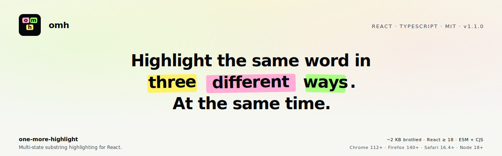

<p align="center">
  <a href="https://one-more-highlight.vercel.app">
    <picture>
      <source media="(prefers-color-scheme: dark)" srcset="./assets/banner-short.svg" />
      
    </picture>
  </a>
</p>

# omh · one-more-highlight

> Multi-state substring highlighting for React.

[](./LICENSE)
[](https://www.npmjs.com/package/one-more-highlight)
[](https://www.npmjs.com/package/one-more-highlight)
[](https://github.com/ronenmars/one-more-highlight/actions)
[](https://github.com/ronenmars/one-more-highlight/releases/latest)
[](https://www.npmjs.com/package/one-more-highlight)
[](https://www.npmjs.com/package/one-more-highlight?activeTab=dependencies)

Highlight every occurrence of a substring in one style, **and** highlight specific occurrences — by **single index**, **index range**, or **arbitrary list of indices** — in another style. TypeScript-first, headless-friendly, ~2KB brotlied, zero CSS shipped.

> *Dedicated to Chester Bennington. Inspired by the idea that every small light matters.*
>
> — *"I tried so hard and got so far…"* — we built this so the right words could shine.

---

## Why this exists

**`one-more-highlight`** gives you:

- **TypeScript-first** — full types and a discriminated-union `HighlightState` that narrows correctly on the selector field (`index`, `range`, `indices`, `term`, or `term + nth`).
- **Multi-state styling** as the headline feature — every match gets a base style, plus layered styles selected by index, range, or arbitrary list. Styles compose.
- **Headless `useHighlight` hook** alongside the `<Highlight>` component, with a `renderMatch` render-prop for full per-match control.
- **Tiny** — ~2 KB brotlied (ESM), 2 microscopic deps (`clsx` + `escape-string-regexp`).
- **Modern** — React 18+/19, ESM + CJS dual build with `.d.ts` + `.d.cts`, tree-shakeable, SSR-safe.

```tsx
import { Highlight } from 'one-more-highlight';

<Highlight
  text="time time time time time"
  searchWords={['time']}
  highlightClassName="bg-yellow-200"
  states={[
    { name: 'active',     index: 2,         className: 'bg-orange-500 ring-2' },
    { name: 'preview',    range: [0, 1],    className: 'bg-blue-100' },
    { name: 'bookmarked', indices: [3, 4],  className: 'underline' },
  ]}
/>
```

A single match can be in multiple states at once; their `className`s concatenate and their `style`s shallow-merge.

## Install

```bash
pnpm add one-more-highlight
# or: npm i one-more-highlight / yarn add one-more-highlight
```

Peer: `react >= 18`. Runtime deps: `clsx`, `escape-string-regexp` (both MIT, ~400 B combined).

## Usage

### Component (drop-in)

```tsx
import { Highlight } from 'one-more-highlight';

<Highlight text="hello world" searchWords={['world']} />
// → "hello <mark>world</mark>"
```

### Headless hook (DIY rendering)

```tsx
import { useHighlight } from 'one-more-highlight';

function MyHighlighter({ text, query }: { text: string; query: string }) {
  const { segments } = useHighlight({ text, searchWords: [query] });
  return (
    <p>
      {segments.map((s, i) =>
        s.isMatch ? <mark key={i}>{s.text}</mark> : <span key={i}>{s.text}</span>,
      )}
    </p>
  );
}
```

### Multi-state styling (the headline feature)

```tsx
import { Highlight } from 'one-more-highlight';

<Highlight
  text={longText}
  searchWords={['React']}
  highlightClassName="hl-base"
  states={[
    { name: 'active',     index: activeIdx,   className: 'hl-active' },
    { name: 'recent',     range: [0, 4],      className: 'hl-recent' },
    { name: 'bookmarked', indices: bookmarks, className: 'hl-bookmark' },
  ]}
/>
```

Every match gets `hl-base`. Match `activeIdx` *also* gets `hl-active`. Matches 0–4 *also* get `hl-recent`. Matches in `bookmarks` *also* get `hl-bookmark`. Classes concatenate, styles shallow-merge in declaration order.

### Render-prop for full per-match control

```tsx
<Highlight
  text={text}
  searchWords={['error']}
  states={[{ name: 'active', index: 2 }]}
  renderMatch={(seg, { className, style, Tag }) => (
    <Tag className={className} style={style}>
      {seg.text}
      {seg.states.includes('active') && <ActiveBadge />}
    </Tag>
  )}
/>
```

`renderMatch` receives the resolved className/style/Tag for the match. Return whatever React node you want — string, fragment, custom element, null (renders raw text).

## API

### `<Highlight>` props

| Prop | Type | Default | Description |
| --- | --- | --- | --- |
| `text` | `string` | required | The text to highlight inside. |
| `searchWords` | `Array<string \| RegExp>` | required | Terms to find. RegExps are cloned with `g` flag forced on. |
| `caseSensitive` | `boolean` | `false` | Match case (string terms only; regex flags are honored). |
| `autoEscape` | `boolean` | `true` | Escape regex special chars in string terms. |
| `sanitize` | `(s: string) => string` | — | Pre-process text and search source before matching (e.g. for diacritic-insensitive search). |
| `findChunks` | `(input) => RawChunk[]` | — | Custom matcher; replaces the default. |
| `states` | `HighlightState[]` | — | Per-match layered styling. See below. |
| `overlapStrategy` | `'merge' \| 'nest' \| 'first-wins'` | `'merge'` | How to handle overlapping matches. |
| `highlightTag` | `keyof JSX.IntrinsicElements \| Component` | `'mark'` | Element/component for matches. Custom components receive `matchIndex` and `states` props. |
| `highlightClassName` | `string` | — | Base className for every match. |
| `highlightStyle` | `CSSProperties` | — | Base inline style for every match. |
| `unhighlightTag` | `keyof JSX.IntrinsicElements` | — | Element to wrap non-matches (default: no wrapper). |
| `unhighlightClassName` | `string` | — | className for non-matches (only applied if `unhighlightTag` is set). |
| `unhighlightStyle` | `CSSProperties` | — | Inline style for non-matches. |
| `renderMatch` | `(seg, defaults) => ReactNode` | — | Full render-prop control over match output. |
| `as` | `keyof JSX.IntrinsicElements` | `'span'` | Root wrapper element. |
| `className` | `string` | — | className on the root wrapper. |
| `style` | `CSSProperties` | — | Inline style on the root wrapper. |

### `useHighlight(options)` → `{ segments, getMatchCount }`

Same options as `<Highlight>` minus the rendering props. Returns an object with:

- `segments` — alternating `MatchSegment` / `TextSegment` covering the full text.
- `getMatchCount()` — returns the number of matching segments; useful for validating `states` config or rendering "X results" UI.

```typescript
type Segment = MatchSegment | TextSegment;

interface MatchSegment {
  text: string;
  isMatch: true;
  matchIndex: number;        // 0-based document order
  termIndex: number;         // index into searchWords that produced this match
  start: number;             // index in original text
  end: number;
  states: ReadonlyArray<string>;  // names of states this match belongs to
}

interface TextSegment {
  text: string;
  isMatch: false;
  start: number;
  end: number;
}
```

### `HighlightState` selector forms

`HighlightState` is a discriminated union — each entry carries **exactly one** selector field that says which matches it applies to. TypeScript narrows on the field name.

```typescript
// Five selector shapes, picked by which field is present:
{ name: 'active',     index: 2 }            // a single match
{ name: 'preview',    range: [4, 6] }       // an inclusive range
{ name: 'bookmarked', indices: [0, 4, 7] }  // an arbitrary list
{ name: 'feline',     term: 'cat' }         // every match of a search word
{ name: 'first-cat',  term: 'cat', nth: 0 } // a specific occurrence of a search word
```

```typescript
const states = [
  { name: 'active',  index: 2,      className: 'is-active' },
  { name: 'preview', range: [0, 1], style: { background: '#5EEAD4' } },
];
```

## Behavior notes

- **Overlapping matches** default to `merge` (collapsed into one segment). Choose `nest` to keep each match individually addressable, or `first-wins` to drop later overlaps.
- **Indexing is global document order.** Match #0 is the first match in the text regardless of which `searchWords` entry produced it.
- **Out-of-range state indices** are silently ignored in production; a one-time `console.warn` fires in dev mode.
- **Regex defenses**: consumer-supplied `RegExp` is always cloned, the `g` flag is forced on, and the sticky `y` flag is dropped (with a dev warning). This prevents the mutable-`lastIndex` footgun.
- **Accessibility**: default `<mark>` carries native `mark` semantics. When `highlightTag` is overridden to a non-semantic element, `role="mark"` is added automatically. The shipped playground and docs palettes are tuned to **WCAG 2.2 AAA** contrast (≥ 7:1 for normal text) across every highlight/text pair — copy them as-is, or use them as a reference when building your own. See the [Accessibility recipe](./docs/site/docs/recipes/accessibility.md) for verification tools (WebAIM, axe-core, overlay widgets).
- **SSR**: pipeline contains no `window`/`document` reads and produces deterministic markup.

## Browser & runtime support

| Environment | Requirement | Notes |
| --- | --- | --- |
| **Browsers** | Modern evergreen (Chrome 112+, Firefox 140+, Safari 16.4+) | `RegExp.escape()` is used natively where available (Chrome 134+, Firefox 134+, Safari 18.4+); older evergreens fall back to `escape-string-regexp`. |
| **Node.js** | 18+ | `escape-string-regexp` v5 is ESM-only and requires Node 18+. If you need Node 16, pin `escape-string-regexp` to v4 and add it to your own dependencies. |
| **React** | 18 or 19 | Peer dependency. |
| **TypeScript** | 5.0+ | `exactOptionalPropertyTypes` and `verbatimModuleSyntax` are used internally; consumers do not need these flags. |

## Recipes

### Diacritic-insensitive search

Strip diacritics from both the text and the search terms before matching, then render against the original text:

```tsx
const normalize = (s: string) =>
  s.normalize('NFD').replace(/\p{Diacritic}/gu, '');

<Highlight
  text="Héllo wörld"
  searchWords={['hello', 'world']}
  sanitize={normalize}
/>
// highlights "Héllo" and "wörld" despite the accents
```

`sanitize` is applied to both the text and each search word before matching. The highlighted output always uses the original, un-normalized text.

## Engines

`one-more-highlight` ships three rendering engines that share the same matching pipeline:

- **DOM engine** (default) — `<Highlight>` from `'one-more-highlight'`. Wraps each match in a `<mark>` node. Supports `renderMatch`, custom tags, and per-state inline style. Universal browser support.
- **CSS Custom Highlight API engine** (opt-in) — `<CssHighlight>` from `'one-more-highlight/css'`. Paints ranges via `CSS.highlights` with no per-match DOM nodes. Larger perf win on long text. See the [engines/css-highlights](https://one-more-highlight.vercel.app/docs/engines/css-highlights) docs page.
- **React Native engine** (opt-in) — `<HighlightText>` from `'one-more-highlight/native'`. Renders matches as nested `<Text>` runs. Same selectors and multi-state styling; styles are `TextStyle` objects instead of `className`. See [React Native](#react-native) below and the [engines/react-native](https://one-more-highlight.vercel.app/docs/engines/react-native) docs page.

## React Native

The matching pipeline is platform-free, so the same selectors, overlap strategies, and multi-state styling work under React Native. Import from the `/native` subpath:

```tsx
import { HighlightText } from 'one-more-highlight/native';

<HighlightText
  text="the quick brown fox"
  searchWords={['quick', 'fox']}
  highlightStyle={{ backgroundColor: '#FFF166' }}
  states={[{ name: 'active', term: 'fox', style: { fontWeight: 'bold' } }]}
/>;
```

`react-native` is an **optional peer dependency** — it is pulled in only when you import `/native`, so web-only consumers are unaffected.

### Headless hook (works today, any renderer)

`useHighlight` has no DOM dependency and can be used directly in RN without the component — render the segments however you like:

```tsx
import { Text } from 'react-native';
import { useHighlight } from 'one-more-highlight/native';

function Highlighted({ text, term }: { text: string; term: string }) {
  const { segments } = useHighlight({ text, searchWords: [term] });
  return (
    <Text>
      {segments.map((seg, i) =>
        seg.isMatch ? (
          <Text key={i} style={{ backgroundColor: '#FFF166' }}>
            {seg.text}
          </Text>
        ) : (
          seg.text
        ),
      )}
    </Text>
  );
}
```

### Scroll to a match

Match `<Text>` runs are virtual nodes with no host handle, and RN has no substring measurement — so the library reports **the box of the line each match falls on, relative to the root `<Text>`**, derived from the already-computed match offsets (no `indexOf` re-matching).

```tsx
import { useRef } from 'react';
import { View } from 'react-native';
import { HighlightText } from 'one-more-highlight/native';
import type { HighlightLayoutHandle } from 'one-more-highlight/native';

const layout = useRef<HighlightLayoutHandle>(null);
const rowRef = useRef<View>(null);

<View ref={rowRef}>
  <HighlightText
    text={text}
    searchWords={[needle]}
    states={[{ name: 'active', index: 0 }]}
    layoutRef={layout}
    onMatchesLayout={(matches) => {
      // matches: { matchIndex, termIndex, start, end, lineIndex, y, height }[]
    }}
  />
</View>;

// Later — resolve the active match against the list row and scroll to it:
const box = await layout.current?.measureMatch(0, rowRef);
if (box) listRef.current?.scrollToOffset({ offset: box.y });
```

- `onMatchesLayout` fires on `onTextLayout` **and** whenever `searchWords`/segments change even if the layout doesn't re-fire; emits `[]` when a re-match finds nothing; composes with a `textProps.onTextLayout` you supply. A match that wraps across lines reports its **first** line; under `numberOfLines` truncation only rendered lines are reported.
- `getMatchLayout(matchIndex)` → sync `{ start, end, lineIndex, y, height } | null` from cache. `measureMatch(matchIndex, relativeTo?)` → async coords in an ancestor's or the window's space. Both hang off `layoutRef`, kept separate from `ref` (still the raw container `<Text>`).
- Web has no equivalent — DOM matches are real elements, so `scrollIntoView` already covers this.

### Differences from the DOM engine

- **No `className`.** Style with `highlightStyle`, `unhighlightStyle`, and `HighlightState.style` (all `StyleProp<TextStyle>`). Per-state styles cascade in declaration order — the last matching state wins, same as the web engine.
- **No `<mark>` / `role="mark"`.** React Native has no `mark` accessibility role. For an accessible callout, pass `accessibilityLabel` via `textProps`, or use `renderMatch` to render your own node.
- **No CSS Custom Highlight API engine.** `/css` is web-only; there is no RN analog.
- **Nested-`<Text>` caveats.** Background color, line height, and vertical alignment of nested text spans behave differently across iOS and Android (Android in particular shifts the baseline when a span changes `fontSize`, and does not clip `borderRadius` on text spans). `numberOfLines` truncation is controlled by the outer container `<Text>` via `textProps`.
- **Metro resolution.** New Metro (RN 0.79+) resolves the `/native` subpath via the package `exports` map. Older Metro resolves it through a bundled path shim, so no configuration is needed either way.

## Roadmap

See [`docs/ROADMAP.md`](./docs/ROADMAP.md) for the full v2+ plan. Short version:

- **Grapheme-aware matching** via `Intl.Segmenter`
- **Fuzzy matching** (Levenshtein)
- **Stable match IDs** for references that survive data changes

## Contributing

See [`CONTRIBUTING.md`](./CONTRIBUTING.md). Bug reports and edge-case fuzz cases especially welcome.

## License

MIT © Ronen Mars. See [`LICENSE`](./LICENSE).

---

> *"In the end, it doesn't even matter"* — except when it does.
> Every match. Every word. Every voice that mattered.
> R.I.P. Chester. 🤍
