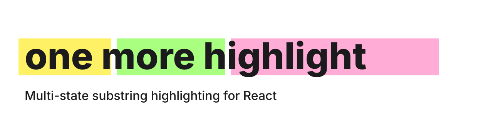

<picture>
  <source media="(prefers-color-scheme: dark)" srcset="./docs/assets/banner-dark.svg">
  
</picture>

# omh · one-more-highlight

> Multi-state substring highlighting for React — and for no framework at all.

[](./LICENSE)
[](https://www.npmjs.com/package/one-more-highlight)
[](https://www.npmjs.com/package/one-more-highlight)
[](https://github.com/ronenmars/one-more-highlight/actions)
[](https://github.com/ronenmars/one-more-highlight/releases/latest)
[](https://www.npmjs.com/package/one-more-highlight)
[](https://www.npmjs.com/package/one-more-highlight?activeTab=dependencies)

> *Dedicated to Chester Bennington. Inspired by the idea that every small light matters.*
>
> — *"I tried so hard and got so far…"* — we built this so the right words could shine.

---

## Why this exists

**`one-more-highlight`** gives you:

- **TypeScript-first** — full types and a discriminated-union `HighlightState` that narrows correctly on the selector field (`index`, `range`, `indices`, `term`, or a `match` predicate).
- **Multi-state styling** as the headline feature — every match gets a base style, plus layered styles selected by index, range, or arbitrary list. Styles compose.
- **Bring your own matches** — `ranges={[…]}` takes precomputed offsets from Algolia, a server-side matcher, an NLP tokenizer or AI citations instead of `searchWords`; the two are mutually exclusive at the type level.
- **Headless `useHighlight` hook** alongside the `<Highlight>` component, with a `renderMatch` render-prop for full per-match control.
- **Tiny** — ~2.7 KB brotlied (ESM), 2 microscopic deps (`clsx` + `escape-string-regexp`).
- **Modern** — React 18+/19, ESM + CJS dual build with `.d.ts` + `.d.cts`, tree-shakeable, SSR-safe.
- **Works without React** — `one-more-highlight/vanilla` runs the same pipeline over any DOM subtree, matching across element boundaries, with a `<script src>` build for pages that have no bundler.

<picture>
  <source media="(prefers-color-scheme: dark)" srcset="./docs/assets/multi-state-demo-dark.svg">
  
</picture>

## Install

```bash
pnpm add one-more-highlight
# or: npm i one-more-highlight / yarn add one-more-highlight
```

Peer: `react >= 18` (**optional** — not needed for the vanilla entry). Runtime deps: `clsx`, `escape-string-regexp` (both MIT, ~400 B combined).

## Quick start

```tsx
import { Highlight } from 'one-more-highlight';

<Highlight
  text="time time time time time"
  searchWords={['time']}
  highlightClassName="bg-yellow-200"
  states={[
    { name: 'active',     index: 2,         className: 'bg-orange-500 ring-2' },
    { name: 'preview',    range: [0, 1],    className: 'bg-blue-100' },
    { name: 'bookmarked', indices: [3, 4],  className: 'underline' },
  ]}
/>
```

A single match can be in multiple states at once; their `className`s concatenate and their `style`s shallow-merge in declaration order.

## Engines

`one-more-highlight` ships four rendering engines that share the same matching pipeline. The default `<Highlight>` from `'one-more-highlight'` wraps each match in a DOM node; `<CssHighlight>` from `'one-more-highlight/css'` paints via the CSS Custom Highlight API with zero per-match DOM nodes (faster on long text); `<HighlightText>` from `'one-more-highlight/native'` renders nested `<Text>` runs for React Native; and `one-more-highlight/vanilla` needs no framework at all.

See [engines/css-highlights](https://one-more-highlight.vercel.app/docs/engines/css-highlights), [engines/react-native](https://one-more-highlight.vercel.app/docs/engines/react-native) and [engines/vanilla](https://one-more-highlight.vercel.app/docs/engines/vanilla).

### Vanilla JS — no framework, no build step

`one-more-highlight/vanilla` highlights text in **any DOM subtree**, including markup you don't own. It matches across element boundaries, paints with the CSS Custom Highlight API without touching the DOM, and falls back to `<mark>` injection where that API is missing.

**Install it the same way** — `react` is an optional peer dependency, so a plain-JS project pulls in nothing extra:

```bash
pnpm add one-more-highlight
# or: npm i one-more-highlight / yarn add one-more-highlight
```

```js
import { Highlighter } from 'one-more-highlight/vanilla';

const h = new Highlighter(document.querySelector('#article'));
h.mark(['ipsum', 'dolor'], {
  states: [
    { name: 'term-ipsum', term: 'ipsum' },
    { name: 'term-dolor', term: 'dolor' },
  ],
});
```

Nothing renders until you style the highlight names — the package ships zero CSS by design:

```css
::highlight(term-ipsum) { background: #FFF166; color: #1b1b1d; }
::highlight(term-dolor) { background: #FFADD6; color: #1b1b1d; }
```

**Or skip the bundler entirely.** The package ships an IIFE build (~3.2 KB brotlied) that defines a global, served straight from npm by jsDelivr and unpkg:

```html
<script src="https://cdn.jsdelivr.net/npm/one-more-highlight@1/dist/omh.global.js"></script>
<script>
  new OMH.Highlighter(document.body).mark('time');
</script>
```

Everything the React entry can select — `index`, `range`, `indices`, `term`, `nth`, a `match` predicate — works identically here, plus `markRanges()` for precomputed offsets and the three overlap strategies.

📖 **[Full vanilla guide →](https://one-more-highlight.vercel.app/docs/engines/vanilla)** — API reference, the two renderers, CDN pinning and SRI, cross-element matching, shadow DOM, and the document-global highlight-name registry (the one real footgun). Runnable examples live in [`examples/vanilla/`](./examples/vanilla/).

## Accessibility & navigation

`one-more-highlight/a11y` ships `<AccessibleHighlight>`, a drop-in replacement for `<Highlight>` with a `mode` prop (`'native' | 'dual' | 'annotated'`) that makes the DOM-`<mark>`-vs-assistive-technology tradeoff explicit instead of accidental, plus `<MatchAnnouncer>`, a debounced `role="status"` live region for announcing result count and navigation position. `one-more-highlight/navigation` ships `useRovingMatchFocus`, a standard roving-tabindex hook for keyboard-navigating matches (arrow keys, Home/End) that composes with the core hook's `getMatchNode`.

```tsx
import { AccessibleHighlight, MatchAnnouncer } from 'one-more-highlight/a11y';
import { useRovingMatchFocus } from 'one-more-highlight/navigation';
```

See [api/accessible-highlight](https://one-more-highlight.vercel.app/docs/api/accessible-highlight), [api/match-announcer](https://one-more-highlight.vercel.app/docs/api/match-announcer), and [api/use-roving-match-focus](https://one-more-highlight.vercel.app/docs/api/use-roving-match-focus).

## Browser & runtime

React 18+/19 (optional), Node 18+, modern evergreens (Chrome 112+, Firefox 140+, Safari 16.4+). The vanilla entry's `css` renderer needs the CSS Custom Highlight API (Baseline since March 2026) and falls back to `<mark>` injection without it. Full matrix → [recipes/browser-support](https://one-more-highlight.vercel.app/docs/recipes/browser-support).

## Documentation

| Topic | Where |
| --- | --- |
| Getting started — install, intro, quick start | [docs site → getting-started](https://one-more-highlight.vercel.app/docs/getting-started/intro) |
| Guides — basic highlighting, headless hook, multi-state styling, render-prop | [docs site → guides](https://one-more-highlight.vercel.app/docs/guides/basic-highlighting) |
| API reference — `<Highlight>` props, `useHighlight`, types, `HighlightState` selectors | [docs site → api](https://one-more-highlight.vercel.app/docs/api/highlight-props) |
| Recipes — accessibility, diacritic-insensitive search, overlap strategies, browser support | [docs site → recipes](https://one-more-highlight.vercel.app/docs/recipes/accessibility) |
| Engines — CSS Custom Highlight API, React Native | [docs site → engines](https://one-more-highlight.vercel.app/docs/engines/css-highlights) |
| **Vanilla JS** — no-framework engine, CDN usage, DOM walking | [docs site → engines/vanilla](https://one-more-highlight.vercel.app/docs/engines/vanilla) |
| Roadmap (v2+ plan) | [`docs/ROADMAP.md`](./docs/ROADMAP.md) |
| Architecture decisions | [`docs/adr/`](./docs/adr/) |

## Contributing

See [`CONTRIBUTING.md`](./CONTRIBUTING.md). Bug reports and edge-case fuzz cases especially welcome.

## License

MIT © Ronen Mars. See [`LICENSE`](./LICENSE).

---

> *"In the end, it doesn't even matter"* — except when it does.
> Every match. Every word. Every voice that mattered.
> R.I.P. Chester. 🤍
